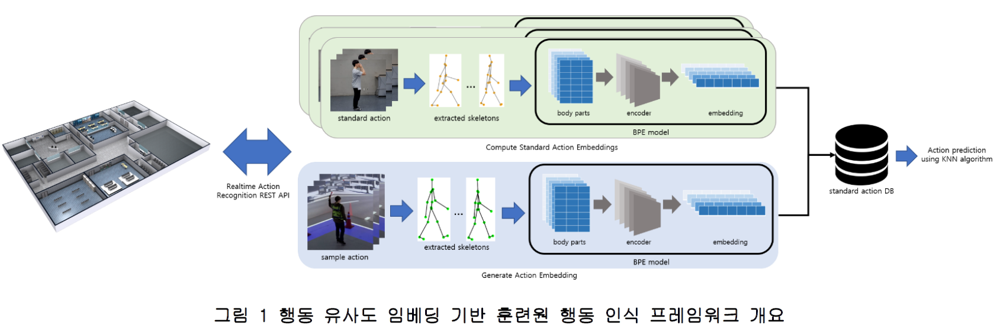

# Real-time Trainee Action Recognition using Action Similarity Embeddings (KCC2022)

["Real-time Trainee Action Recognition using Action Similarity Embeddings"](https://www.dbpia.co.kr/Journal/articleDetail?nodeId=NODE11113552). KCC2022.\
Jongwhoa Lee*, Minho Sim*, and Ho-Jin Choi\
Korea Advanced Institute of Science and Technology, Daejeon, South Korea

## Overview



## Dependencies

Install dependencies:

```
pip install -r requirements.txt
```

Setup project:

```
pip install .
```

## Action recognition pipeline

- Prepare body part embedding ([BPE](https://github.com/chico2121/bpe)) model.
- Extracts human skeletons from video frames using a pre-trained pose estimator.
- Using the BPE model, compute action embeddings for each video in the training set to create **Standard Action DB**
- Given the test sample, recognize action following the below steps:
  1. Extract body part embeddings following same process when creating standard action DB.
  2. Perform time alignment between test embedding and train embeddings using dynamic time warping (DTW) algorithm.
  3. Calculate cosine distances between embeddings.
  4. Predict actions using K-nearest neighbors (K-NN) algorithm.

## Results


